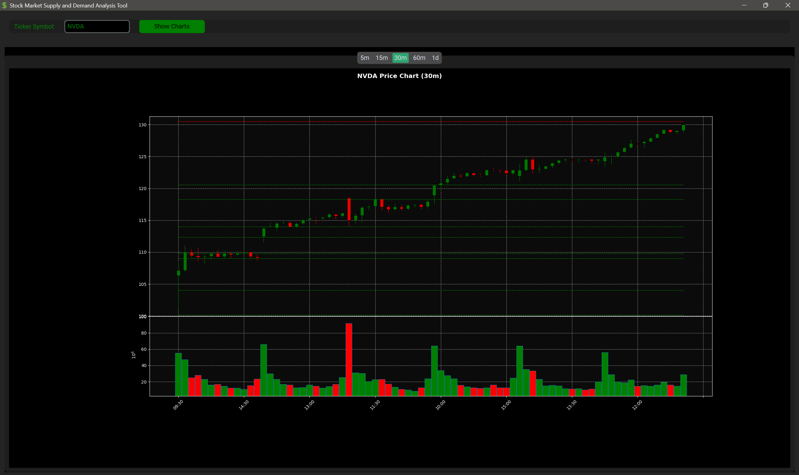

# Stock Market Supply and Demand Analysis Tool

A Python-based desktop application for analyzing stock market supply and demand zones using custom Tkinter, yfinance, and mplfinance. This tool allows users to input a ticker symbol and visualize candlestick charts with identified supply and demand zones.



## Features

- **Candlestick Charts:** Visualize stock price movements using candlestick charts.
- **Supply and Demand Zones:** Automatically identify and plot supply and demand zones on the charts.
- **Multiple Time Intervals:** View charts for different intervals (5m, 15m, 30m, 60m, and 1d).
- **Dark Mode:** The application comes with a dark-themed UI for better user experience.

## Installation

### Prerequisites

Ensure you have Python 3.x installed on your system. You can download it from [python.org](https://www.python.org/).

### Required Python Packages

This project requires the following Python packages:
- `yfinance`
- `mplfinance`
- `customtkinter`
- `matplotlib`

You can install them using `pip`:

```bash
pip install yfinance mplfinance customtkinter matplotlib
```

### Setting Up the Project

1. Clone this repository to your local machine:

   ```bash
   git clone https://github.com/ry-schwartz/stock-market-analysis-tool.git
   cd stock-market-analysis-tool
   ```

2. Place the required image (`dollar_icon.ico`) in the root directory of the project.

3. Ensure all dependencies are installed (as mentioned above).

### Usage

To run the application, navigate to the project directory and execute the following command:

   ```bash
   python app.py
   ```

1. Enter the ticker symbol of the stock you want to analyze in the provided input field.
2. Click on **Show Charts** to generate the candlestick chart with identified supply and demand zones.
3. Switch between different time intervals (5m, 15m, 30m, 60m, and 1d) using the tabs at the top.

### Troubleshooting

- If the application fails to fetch data, ensure you have an active internet connection.
- If no data is displayed for a ticker, verify that the ticker symbol is correct and listed on Yahoo Finance.

### Contributing

Contributions are welcome! Please fork the repository and submit a pull request if you wish to improve the application or fix bugs.

